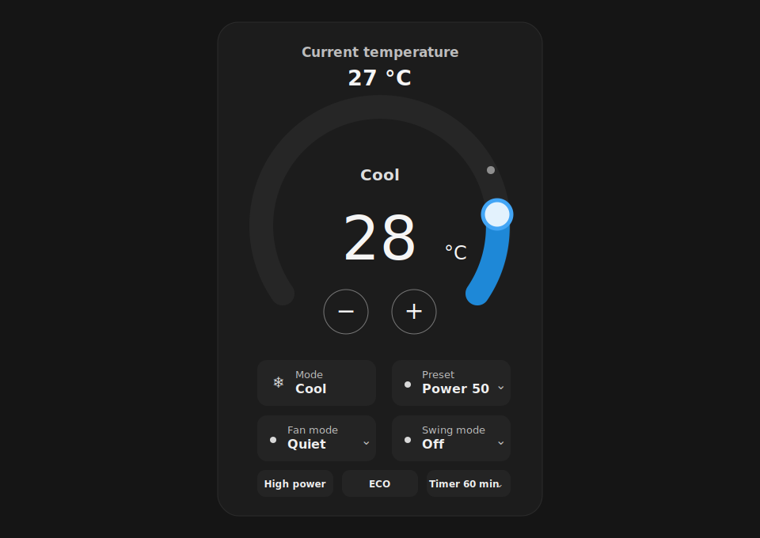

# Toshiba AC Plus Card



A Home Assistant Lovelace dashboard card for Toshiba AC units exposed through the Toshiba AC Community integration.

It provides a compact circular thermostat-style climate card with practical extra controls:

- Current temperature + draggable/clickable target temperature dial
- Plus/minus target temperature buttons
- Mode dropdown tile
- Preset dropdown tile
- Fan mode dropdown tile
- Swing mode dropdown tile
- High power toggle
- ECO toggle
- Optional native Home Assistant timer helper selector

This is a **frontend/dashboard card only**. It does not create a second Home Assistant integration or add extra devices next to your existing Toshiba AC integration.

## Installation through HACS as a custom repository

1. Open **HACS**.
2. Open **Custom repositories**.
3. Add this repository URL:

   ```text
   https://github.com/kloboucek/toshiba-ac-plus-card
   ```

4. Category: **Dashboard**.
5. Install **Toshiba AC Plus Card**.
6. Refresh your browser.
7. Add the card to a dashboard.

## Basic card

```yaml
type: custom:toshiba-ac-plus-card
entity: climate.living_room
name: Living Room AC
```

The card uses the selected climate entity for thermostat display, HVAC modes, swing mode, and fan mode.

## Feature buttons

By default, the card tries to auto-detect related Toshiba feature entities using the climate entity object ID.

For example:

```text
climate.living_room
```

will try:

```text
switch.living_room_high_power_mode
switch.living_room_eco_mode
```

You can override feature entities manually:

```yaml
type: custom:toshiba-ac-plus-card
entity: climate.living_room
name: Living Room AC
features:
  auto_detect: true
  high_power: switch.living_room_high_power_mode
  eco: switch.living_room_eco_mode
```

Disable a button by setting it to `false`:

```yaml
features:
  eco: false
```

## Timer support

The card can start/cancel a native Home Assistant `timer` helper. This keeps the UI simple while Home Assistant handles the actual countdown.

```yaml
type: custom:toshiba-ac-plus-card
entity: climate.living_room
name: Living Room AC
timer:
  entity: timer.living_room_ac_off_timer
  durations:
    - 15
    - 30
    - 60
    - 90
    - 120
```

When a duration is selected, the card calls `timer.start`. When **Off** is selected, it calls `timer.cancel`.

### Turning the AC off when the timer finishes

A frontend card cannot reliably wait in the browser and turn the AC off later, because the browser tab may be closed. Use the included blueprint to run the final `climate.turn_off` action in Home Assistant.

1. Create a Home Assistant timer helper, e.g. `timer.living_room_ac_off_timer`.
2. Import `blueprints/automation/toshiba_ac_plus_off_timer.yaml`.
3. Create one automation per AC unit from the blueprint.
4. Select:
   - climate entity: `climate.living_room`
   - timer entity: `timer.living_room_ac_off_timer`

## Multi-room example

```yaml
type: vertical-stack
cards:
  - type: custom:toshiba-ac-plus-card
    entity: climate.living_room
    name: Living Room AC
    timer:
      entity: timer.living_room_ac_off_timer

  - type: custom:toshiba-ac-plus-card
    entity: climate.bedroom
    name: Bedroom AC
    timer:
      entity: timer.bedroom_ac_off_timer

  - type: custom:toshiba-ac-plus-card
    entity: climate.kids
    name: Kids Room AC
    timer:
      entity: timer.kids_ac_off_timer
```

## Notes

- This card does not install or configure the Toshiba AC Community integration.
- Some Toshiba feature entities are unavailable when the AC is off or in an incompatible mode. The card greys those controls out.
- If entity names differ from the auto-detected pattern, configure the feature entities manually.
- Mode, Preset, Fan mode, Swing mode, and Timer use styled in-card dropdown menus. The card pauses live re-rendering while a dropdown is open so menus do not disappear before selection; all menus open upward from their tile.
- When the climate entity is off, Preset, Fan mode, and Swing mode selections are held locally and persisted in browser localStorage per climate entity. They survive dashboard switches/page refreshes in the same browser and are applied only after the user turns the AC on via the main Mode dropdown.
- The visual config editor keeps HA entity pickers mounted during live HA updates, so the climate/timer search dropdowns stay stable while typing.
- When the selected climate entity changes in the visual editor, the default card name follows the new entity unless the name was manually customized.
- The thermostat dial supports both pointer and touch drag handling, with page scrolling disabled while dragging on mobile.
